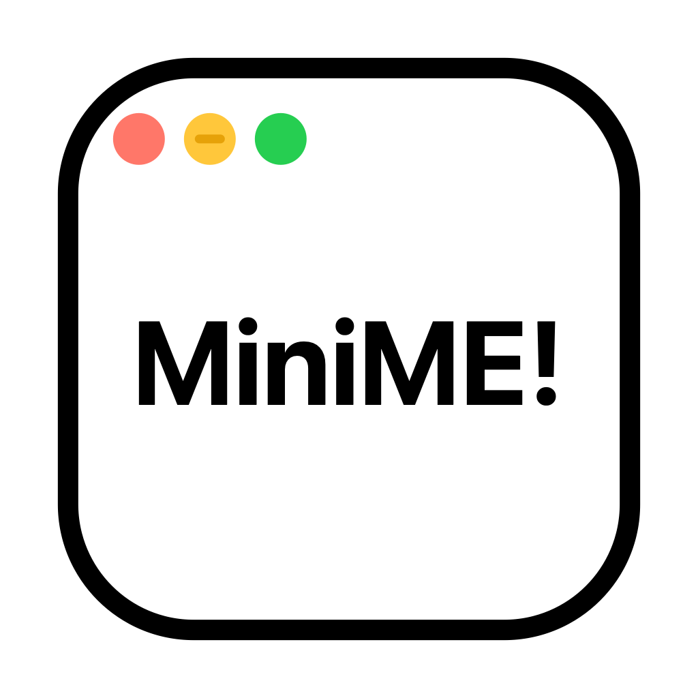

[🇨🇳中文](README_zh.md)

 

# MiniME

<h3>

Click, and minimize

</h3>

        

# Introduction

Simply download the app and grant it Accessibility permissions to enjoy a Windows-like Dock experience with app icons.

# Start

**Author: 铃一贰叁**

If this project helps you, feel free to Star ⭐

